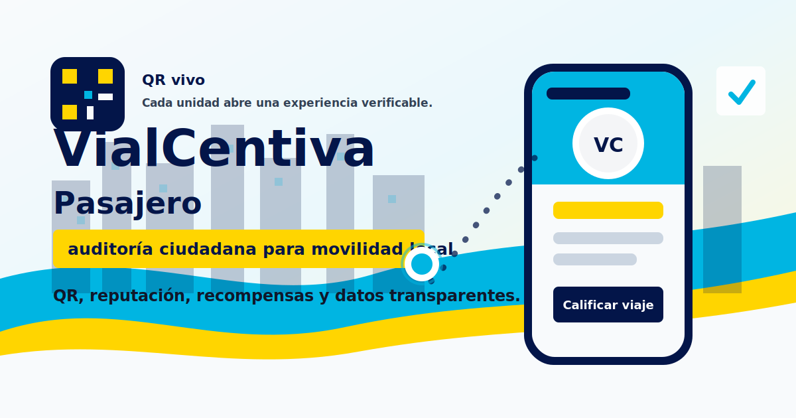
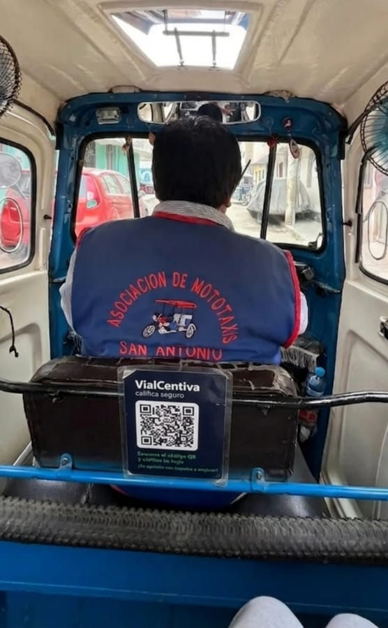
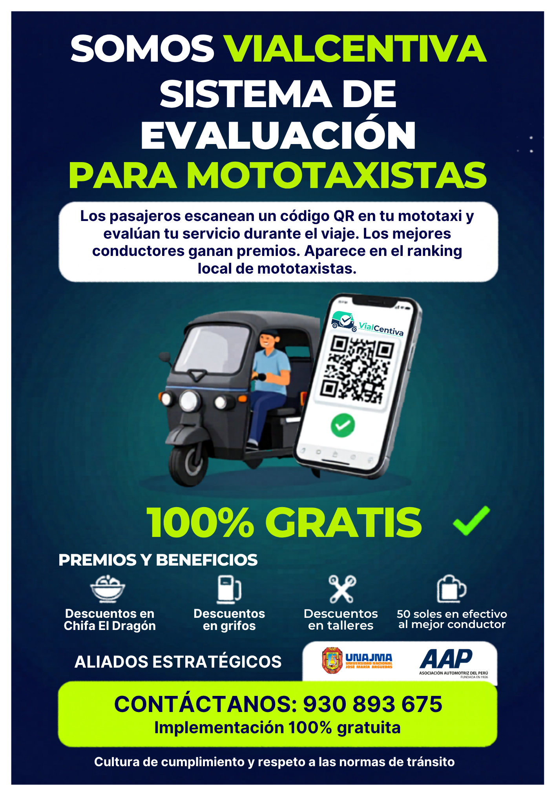
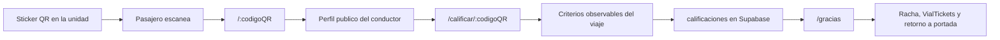
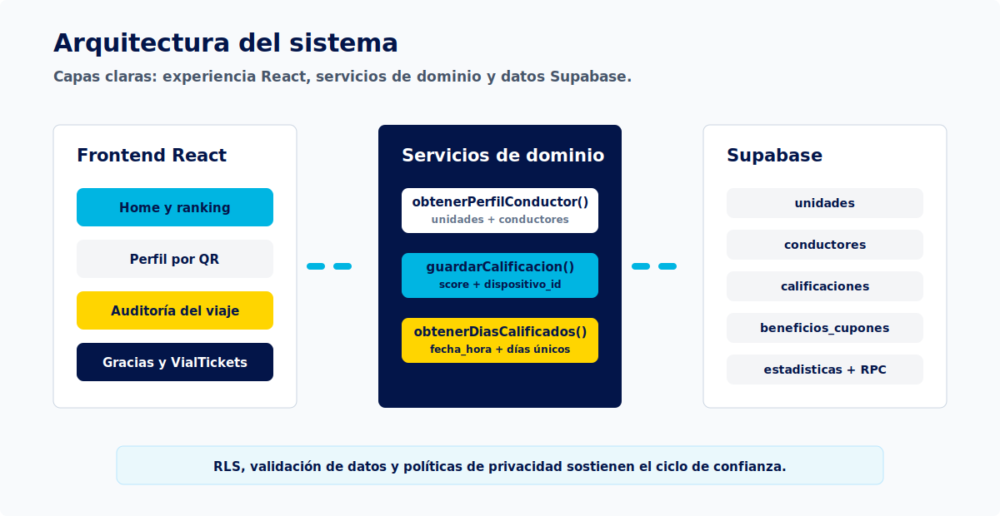

# VialCentiva Pasajero

<p align="center">
  
</p>

<p align="center">
  <a href="#vision-del-proyecto"></a>
  <a href="#stack"></a>
  <a href="#stack"></a>
  <a href="#ejecucion-local"></a>
</p>

VialCentiva Pasajero es la experiencia web publica del ecosistema VialCentiva: permite que una persona escanee el QR de una mototaxi, revise el perfil publico del conductor y registre una evaluacion privada basada en conductas observables del viaje. La aplicacion no busca reemplazar a una autoridad de transito; crea una capa de reputacion ciudadana, datos operativos e incentivos locales para que conducir bien deje de ser invisible.

El proyecto forma parte de una propuesta de validacion para transporte local, cultura vial y movilidad preventiva. En el PMV actual se integran QR por unidad, perfil publico, formulario de auditoria, control por dispositivo, ranking, VialTickets, beneficios y evidencias de activacion en campo.

## Evidencia Visual

<table>
  <tr>
    <td width="50%">
      
    </td>
    <td width="50%">
      
    </td>
  </tr>
  <tr>
    <td colspan="2">
      
    </td>
  </tr>
</table>

## Vision Del Proyecto

En el transporte local, especialmente en mototaxis, el pasajero suele subir sin una referencia confiable sobre quien conduce. A la vez, el conductor prudente, respetuoso y constante no obtiene una ventaja concreta por hacerlo bien. VialCentiva interviene en ese punto: convierte la experiencia del viaje en una senal medible de confianza y transforma la buena conducta en reputacion, ranking y beneficios.

La hipotesis de trabajo es preventiva: si el conductor sabe antes y durante el viaje que sera evaluado por criterios concretos, y que esa reputacion puede darle visibilidad o recompensas, el incentivo cambia antes de que ocurra una mala practica.

## Producto Implementado

| Modulo | Implementacion actual | Valor dentro del PMV |
| --- | --- | --- |
| Perfil publico por QR | Ruta dinamica `/:codigoQR` conectada a `unidades` y `conductores` | Permite reconocer conductor, unidad, sello, promedio y paradero |
| Evaluacion privada | Ruta `/calificar/:codigoQR` con cinco criterios binarios | Reduce friccion y evita formularios largos |
| Persistencia de auditoria | Insercion en `calificaciones` mediante Supabase | Convierte cada viaje en dato operativo |
| Control antifraude basico | `dispositivo_id` generado en navegador y celular opcional | Mitiga duplicidad sin exigir datos sensibles |
| Racha y VialTickets | Ruta `/gracias` calcula dias unicos en ventana de siete dias | Aumenta participacion del pasajero |
| Ranking publico | Portada consulta conductores ordenados por promedio | Hace visible la buena conducta |
| Beneficios | Lectura de `beneficios_cupones` y aliados | Conecta reputacion con incentivos reales |
| Privacidad | Pagina `/privacy` | Explica uso minimo de datos y evaluacion privada |

## Flujo Principal



## Criterios De Evaluacion

La evaluacion evita medir percepciones vagas. Cada pregunta se vincula con una conducta que el pasajero puede observar durante el servicio.

| Criterio | Peso tecnico | Conducta observada |
| --- | ---: | --- |
| Velocidad prudente | 30% | Evita maniobras bruscas y mantiene una conduccion segura |
| No uso del celular | 20% | Mantiene atencion durante el servicio |
| Respeto del paradero | 20% | Sube o baja pasajeros en zonas razonables y seguras |
| Trato respetuoso | 20% | Servicio cordial, claro y sin presion al pasajero |
| Limpieza de unidad | 10% | Interior ordenado, cuidado basico y confianza visual |

La formula se encuentra en [`src/utils/score.js`](src/utils/score.js). La insercion en base de datos se concentra en [`src/services/api.js`](src/services/api.js).

## Arquitectura

<p align="center">
  
</p>

La aplicacion se organiza en tres capas:

| Capa | Archivos principales | Responsabilidad |
| --- | --- | --- |
| Experiencia publica | `src/pages/Home.jsx`, `src/components/Home/*` | Portada, ranking, estadisticas, beneficios y narrativa institucional |
| Flujo QR | `src/pages/DriverProfile.jsx`, `src/pages/RateTrip.jsx`, `src/pages/ThankYou.jsx` | Perfil, auditoria y confirmacion del pasajero |
| Datos y reglas | `src/services/api.js`, `src/services/supabase.js`, `src/utils/*` | Supabase, control de dispositivo, puntaje y racha |

## Rutas

| Ruta | Vista | Proposito |
| --- | --- | --- |
| `/` | `Home` | Portada, metricas, ranking, beneficios e informacion institucional |
| `/:codigoQR` | `DriverProfile` | Perfil publico de la unidad y conductor asociado |
| `/calificar/:codigoQR` | `RateTrip` | Formulario de auditoria ciudadana |
| `/gracias` | `ThankYou` | Confirmacion, racha y VialTickets |
| `/privacy` | `Privacy` | Privacidad y uso responsable de datos |

## Modelo De Datos

| Tabla, vista o funcion | Uso esperado |
| --- | --- |
| `unidades` | Busca la unidad por `qr_unico` y enlaza el conductor |
| `conductores` | Perfil, sello, promedio, ranking y total de viajes |
| `calificaciones` | Registra criterios observados, celular opcional y dispositivo |
| `estadisticas` | Total de visitas de portada |
| `beneficios_cupones` | Beneficios disponibles para usuarios y comunidad |
| `aliados` | Negocios que sostienen incentivos |
| `incrementar_visita` | RPC para registrar visita institucional |

Campos sensibles para auditoria: `qr_unico`, `dispositivo_id`, `fecha_hora`, `celular_pasajero`, `promedio_estrellas`, `total_viajes`.

## Stack

| Capa | Tecnologia | Uso |
| --- | --- | --- |
| UI | React 19 | Vistas, estados y componentes |
| Build | Vite 8 | Desarrollo local y empaquetado |
| Routing | React Router DOM 7 | Rutas publicas y QR dinamico |
| Datos | Supabase JS 2 | Consultas, inserciones y RPC |
| Estilos | Tailwind CSS 4 | Interfaz mobile-first |
| Iconos | Lucide React | Iconografia funcional |
| Calidad | ESLint 10 | Revision estatica |

## Ejecucion Local

```bash
npm install
npm run dev
```

Para probar un QR real en desarrollo:

```bash
http://localhost:5173/TU_CODIGO_QR
```

## Variables De Entorno

Crea un archivo `.env.local` en la raiz del proyecto:

```env
VITE_SUPABASE_URL=https://tu-proyecto.supabase.co
VITE_SUPABASE_ANON_KEY=tu_clave_anonima
```

No subas credenciales privadas al repositorio. La clave anonima debe trabajar junto con politicas RLS configuradas en Supabase.

## Documentacion Interna

| Documento | Contenido |
| --- | --- |
| [`docs/arquitectura-pasajero.md`](docs/arquitectura-pasajero.md) | Flujo tecnico, rutas, datos, scoring y operacion local |
| [`docs/validacion-campo.md`](docs/validacion-campo.md) | Evidencia de campo, lectura academica y proximas mediciones |
| [`docs/reference/VialCentiva_Documentacion_Validacion_Final_Local.docx`](docs/reference/VialCentiva_Documentacion_Validacion_Final_Local.docx) | Informe tecnico editable usado como base de validacion |
| [`docs/github-presentation/index.html`](docs/github-presentation/index.html) | Presentacion HTML del proyecto |

## Roadmap

- Consolidar politicas RLS por rol y por tabla en Supabase.
- Agregar pruebas E2E del flujo QR, evaluacion y confirmacion.
- Incorporar validacion estadistica con muestra real de conductores y pasajeros.
- Generar reportes agregados por paradero, periodo y nivel de reputacion.
- Integrar analitica de patrones atipicos para reforzar control antifraude.
- Conectar el panel administrativo con exportacion de evidencias para aliados e instituciones.

## Creditos

Proyecto desarrollado por William Medina como propuesta tecnologica de movilidad preventiva, reputacion ciudadana e incentivos locales para mototaxis en Apurimac.

<p align="center">
  
</p>
