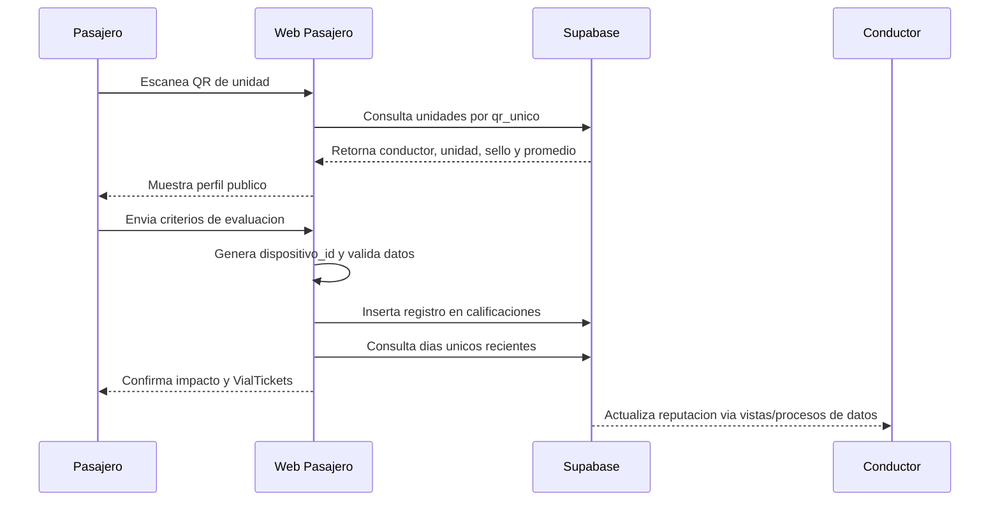

# Arquitectura del modulo Pasajero

Este documento describe la arquitectura funcional del modulo web que recibe las calificaciones del pasajero. Su objetivo es dejar claro como se conectan el QR, la interfaz publica y Supabase dentro del PMV de VialCentiva.

## Proposito

El modulo Pasajero reduce la friccion al minimo: el usuario no instala una app, no crea cuenta y no esta obligado a entregar datos sensibles. Escanea un QR, revisa el perfil publico de la unidad y califica conductas observables del viaje.

## Mapa de rutas

| Ruta | Archivo | Funcion principal |
| --- | --- | --- |
| `/` | `src/pages/Home.jsx` | Portada institucional, metricas, ranking, beneficios y narrativa |
| `/:codigoQR` | `src/pages/DriverProfile.jsx` | Perfil publico de conductor y unidad |
| `/calificar/:codigoQR` | `src/pages/RateTrip.jsx` | Auditoria privada del viaje |
| `/gracias` | `src/pages/ThankYou.jsx` | Confirmacion, racha y VialTickets |
| `/privacy` | `src/pages/Privacy.jsx` | Politicas de privacidad |

## Flujo de datos



## Servicio de datos

La capa `src/services/api.js` concentra la comunicacion con Supabase:

- `obtenerPerfilConductor(codigoQR)`: consulta `unidades` y trae el conductor asociado.
- `guardarCalificacion(conductorId, respuestas)`: transforma respuestas del formulario en campos de la tabla `calificaciones`.
- `obtenerDiasCalificados(celular)`: calcula participacion reciente combinando `dispositivo_id` y celular opcional.

## Regla de puntaje

`src/utils/score.js` calcula una escala de 0 a 5:

| Variable | Peso |
| --- | ---: |
| Velocidad prudente | 0.30 |
| No uso del celular | 0.20 |
| Respeto del paradero | 0.20 |
| Trato respetuoso | 0.20 |
| Limpieza de unidad | 0.10 |

La app registra cada criterio por separado para permitir analisis por comportamiento, no solo un promedio general.

## Privacidad y minimizacion

- El pasajero puede calificar sin crear cuenta.
- El celular es opcional y se usa para beneficios o sorteos.
- `dispositivo_id` se guarda localmente para reducir duplicidad.
- El sistema debe evitar publicar datos sensibles como DNI, telefonos privados o placas completas sin consentimiento.

## Dependencias tecnicas

```bash
npm install
npm run dev
npm run build
npm run lint
```

Variables esperadas:

```env
VITE_SUPABASE_URL=
VITE_SUPABASE_ANON_KEY=
```

## Relacion con el modulo Conductor

El conductor genera o descarga su ficha QR desde el repositorio `vialcentiva-conductor`. Ese QR apunta a la URL publica del pasajero y transporta el `qr_unico` de la unidad. Por eso ambos repositorios comparten el mismo contrato de datos: `conductores`, `unidades`, `calificaciones`, beneficios, aliados y vistas de resumen.
