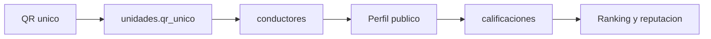

# Base de datos Supabase

VialCentiva Pasajero se conecta a Supabase desde el frontend mediante variables de entorno. Este documento explica que base de datos se utiliza, que tablas debe tener y como se conecta una copia del proyecto sin exponer credenciales privadas.

## Conexion

La conexion esta centralizada en `src/services/supabase.js`:

```js
const supabaseUrl = import.meta.env.VITE_SUPABASE_URL
const supabaseAnonKey = import.meta.env.VITE_SUPABASE_ANON_KEY
```

En local se usa `.env.local`. En produccion se configuran las mismas variables en el proveedor de hosting.

```env
VITE_SUPABASE_URL=https://TU-PROYECTO.supabase.co
VITE_SUPABASE_ANON_KEY=TU_SUPABASE_ANON_KEY
```

La clave anonima puede vivir en el frontend solo si Supabase tiene politicas RLS correctamente configuradas. La `service_role key` nunca debe subirse al repositorio ni usarse en React.

## Tablas principales

| Tabla | Campos usados por el frontend | Proposito |
| --- | --- | --- |
| `unidades` | `numero_padron`, `placa`, `qr_unico`, relacion `conductores` | Identifica la unidad escaneada por QR |
| `conductores` | `id`, `nombre_abreviado`, `paradero`, `nivel_sello`, `promedio_estrellas`, `total_viajes`, `foto_url` | Perfil publico, ranking y reputacion |
| `calificaciones` | `conductor_id`, `dispositivo_id`, `celular_pasajero`, `velocidad_prudente`, `sin_celular`, `trato_respetuoso`, `respeto_paradero`, `limpieza_unidad`, `fecha_hora` | Registro de auditorias ciudadanas |
| `estadisticas` | `total_visitas` | Metrica publica de visitas |
| `beneficios_cupones` | `id`, `descripcion`, `costo_puntos`, `nivel_requerido`, relacion `aliados` | Beneficios visibles en portada |
| `aliados` | `nombre_negocio`, `tipo_negocio`, `nivel_alianza` | Negocios o instituciones que sostienen incentivos |

## RPC esperadas

| RPC | Uso |
| --- | --- |
| `incrementar_visita` | Incrementa visitas de la portada sin bloquear la carga |

## Flujo de consulta



## Reglas importantes

- `qr_unico` debe ser unico por unidad.
- `calificaciones.fecha_hora` debe existir para calcular dias unicos de participacion.
- `calificaciones.dispositivo_id` permite limitar duplicidad por navegador.
- `celular_pasajero` es opcional; no debe bloquear la evaluacion.
- Las relaciones `unidades -> conductores` y `beneficios_cupones -> aliados` deben estar configuradas para que Supabase pueda hacer los selects anidados.

## Checklist para conectar una copia

1. Crear o seleccionar un proyecto Supabase.
2. Crear las tablas y relaciones indicadas.
3. Configurar politicas RLS para lectura publica limitada y escritura controlada.
4. Crear la RPC `incrementar_visita`.
5. Copiar `.env.example` a `.env.local`.
6. Completar `VITE_SUPABASE_URL` y `VITE_SUPABASE_ANON_KEY`.
7. Ejecutar `npm run dev` y probar una ruta `/:codigoQR` con un `qr_unico` real.

## Seguridad

Este repositorio documenta el contrato de datos, no las credenciales reales. Para una entrega publica, lo correcto es explicar la estructura y dejar las claves en el panel del proveedor de despliegue.
